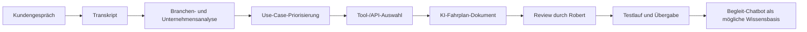

# Architektur · Kivola

Die öffentliche Architektur beschreibt die Analyse- und Delivery-Kette. Sie zeigt keine Rohtranskripte, Kundendaten oder vollständige interne Prompts.

## Komponenten

| Bereich | Aufgabe | Public-safe Detailgrad |
| --- | --- | --- |
| Gespräch/Transkript | Arbeitsalltag und Engpässe erfassen | keine Rohtranskripte |
| Branchenkontext | Alltag, Tools, Erwartungen und Risiken einordnen | Quellenlogik statt private Rechercheergebnisse |
| Analyse/Scoring | Use Cases priorisieren und Annahmen trennen | Methode beschreiben, keine Kundendaten |
| Fahrplan-Generator | Dokumentstruktur erzeugen | Aufbau beschreiben, kein kompletter Prompt |
| Review | Robert prüft Entwurf und schärft Umsetzung | beibehalten |
| Übergabe | Testlauf, Toolwahl, nächste Schritte | public-safe Beispiel |

## Detailtreue

Die Originalstruktur arbeitet phasenbasiert: Vorbereitung, Branchen-Immersion, Research, Analyse/Scoring, Qualitätsgate, Dokumentgenerierung und Übergabe. Öffentlich wird daraus eine verständliche Architektur, keine interne Agentenanleitung.

