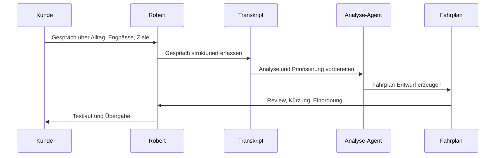

# Workflow · Kivola

## Ablauf

1. Kundengespräch führen.
2. Transkript als Grundlage nutzen.
3. Branche, Arbeitsalltag und Engpässe einordnen.
4. KI-Agent analysiert mögliche Anwendungsfälle, Tool-/API-Lösungen, Risiken und Testlogik.
5. KI-Fahrplan wird generiert.
6. Robert kontrolliert, kürzt, sortiert und macht den Fahrplan verständlich.
7. Fahrplan wird als Arbeitsgrundlage übergeben.
8. Der Fahrplan kann als Wissensbasis für einen Begleit-Chatbot dienen.
9. Testläufe und Übergabe klären, was wirklich in den Alltag übernommen wird.

## Wichtige Entscheidung

Kivola soll nicht jedes Problem mit Eigenbau lösen. Der Fahrplan unterscheidet:

- Bestehendes Tool reicht
- Tool plus kleiner Workflow reicht
- API-/Automationslösung ist sinnvoll
- Eigenes Produkt wäre später sinnvoller

## Arbeitgeber-Signal

Kivola zeigt, dass Robert nicht nur Tools kennt, sondern Kundengespräche in konkrete Einführungslogik übersetzen kann.

